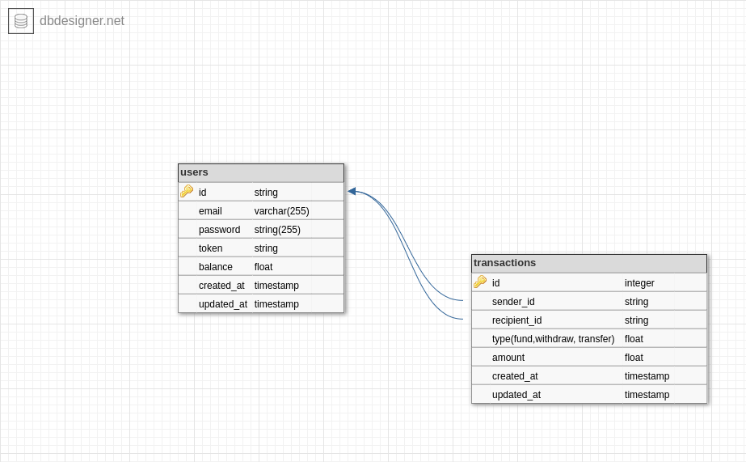

Here's a detailed README for your application, following the specified format:

<a name="readme-top"></a>

<div align="center">
  
  <br/>

  <h3><b>MVP Wallet Application</b></h3>

</div>

# 📗 Table of Contents

- [📖 About the Project](#about-project)
  - [🛠 Built With](#built-with)
    - [Tech Stack](#tech-stack)
    - [Key Features](#key-features)
  - [🚀 Live Demo](#live-demo)
- [💻 Getting Started](#getting-started)
  - [Prerequisites](#prerequisites)
  - [Setup](#setup)
  - [Install](#install)
  - [Usage](#usage)
  - [Run tests](#run-tests)
  - [Deployment](#deployment)
- [👥 Authors](#authors)
- [🔭 Future Features](#future-features)
- [🤝 Contributing](#contributing)
- [⭐️ Show your support](#support)
- [🙏 Acknowledgements](#acknowledgements)
- [❓ FAQ (OPTIONAL)](#faq)
- [📝 License](#license)
- [📊 ER Diagram and SQL](#er-diagram-and-sql) <!-- New Section -->

# 📖 MVP Wallet Application <a name="about-project"></a>

**MVP Wallet Application** is an MVP waller service  designed to manage users' transactions, including funding accounts, transferring funds, and withdrawing funds. The application ensures secure and efficient handling of all financial operations, providing a reliable platform for users.

## 🛠 Built With <a name="built-with"></a>

### Tech Stack <a name="tech-stack"></a>

<details>
  <summary>Client</summary>
  <ul>
    <li>None (<a href="https://api.adjutor.io/">Adjutor API</a> Only)</li>
  </ul>
</details>

<details>
  <summary>Server</summary>
  <ul>
    <li><a href="https://expressjs.com/">Express.js</a></li>
    <li><a href="https://nodejs.org/">Node.js</a></li>
    <li><a href="https://www.typescriptlang.org/">TypeScript</a></li>
  </ul>
</details>

<details>
<summary>Database</summary>
  <ul>
    <li><a href="https://www.mysql.com/">MySQL</a></li>
    <li><a href="https://knexjs.org/">Knex.js</a></li>
  </ul>
</details>

### Key Features <a name="key-features"></a>

- **User Account Funding**: Users can fund their accounts by specifying the amount to be added.
- **Funds Transfer**: Users can transfer funds from their account to another user's account using recipient email.
- **Account Withdrawal**: Users can withdraw funds from their accounts, reducing the balance accordingly.
- **Error Handling and Logging**: Comprehensive error handling and logging for better debugging and user feedback.

<p align="right">(<a href="#readme-top">back to top</a>)</p>

## 🚀 Live Demo <a name="live-demo"></a>

Currently, there is no live demo available for this application.

<p align="right">(<a href="#readme-top">back to top</a>)</p>

## 💻 Getting Started <a name="getting-started"></a>

To get a local copy up and running, follow these steps:

### Prerequisites

In order to run this project, you need to have Node.js, PostgreSQL, and npm installed on your local machine.

### Setup

Clone this repository to your desired folder:

```sh
  cd my-folder
  git clone https://github.com/myaccount/mvp-wallet.git
```

### Install

Install the project dependencies:

```sh
  cd mvp-wallet
  npm install
```

### Usage

To run the project, execute the following command:

```sh
  npm run dev
```

### Run tests

To run tests, run the following command:

```sh
  npm test
```

### Deployment

You can deploy this project using any cloud provider that supports Node.js applications, such as Heroku, AWS, or DigitalOcean.

<p align="right">(<a href="#readme-top">back to top</a>)</p>

## 👥 Authors <a name="authors"></a>

👤 **Tom Udoh**

- GitHub: [tomdan-ai](https://github.com/tomdan-ai)
- LinkedIn: [Tom Udoh](https://linkedin.com/in/tomudoh)

<p align="right">(<a href="#readme-top">back to top</a>)</p>

## 🔭 Future Features <a name="future-features"></a>

- **User Authentication**: Implement more validations user authentication and authorization for more secure transactions.
- **Transaction History**: Add a feature for users to view their transaction history.
- **Email Notifications**: Implement email notifications for successful transactions.

<p align="right">(<a href="#readme-top">back to top</a>)</p>

## 🤝 Contributing <a name="contributing"></a>

Contributions, issues, and feature requests are welcome!

Feel free to check the [issues page](../../issues/).

<p align="right">(<a href="#readme-top">back to top</a>)</p>

## ⭐️ Show your support <a name="support"></a>

If you like this project, please give it a star and share it with your friends!

<p align="right">(<a href="#readme-top">back to top</a>)</p>

## 🙏 Acknowledgements <a name="acknowledgements"></a>

I would like to thank all contributors and the open-source community for their invaluable resources and support.

<p align="right">(<a href="#readme-top">back to top</a>)</p>

## ❓ FAQ (OPTIONAL) <a name="faq"></a>

- **Can I use this application for commercial purposes?**

  - Yes, this application is licensed under the MIT License, which allows for commercial use.

- **How can I contribute to the project?**

  - You can contribute by opening issues, providing feedback, and submitting pull requests.

<p align="right">(<a href="#readme-top">back to top</a>)</p>

# 📊 ER Diagram and SQL <a name="er-diagram-and-sql"></a>

## ER Diagram




## SQL Schema

### Tables

- **Users**
  ```sql
  CREATE TABLE users (
    id SERIAL PRIMARY KEY,
    name VARCHAR(255) NOT NULL,
    email VARCHAR(255) UNIQUE NOT NULL,
    password VARCHAR(255) NOT NULL,
    balance INTEGER DEFAULT 0,
    karma INTEGER DEFAULT 0
  );

To access get full SQL [Click Here](./src/mysql/wallet_service%20ERD_mysql_create.sql)

<p align="right">(<a href="#readme-top">back to top</a>)</p>

## 📝 License <a name="license"></a>

This project is [MIT](./LICENSE) licensed.

<p align="right">(<a href="#readme-top">back to top</a>)</p>